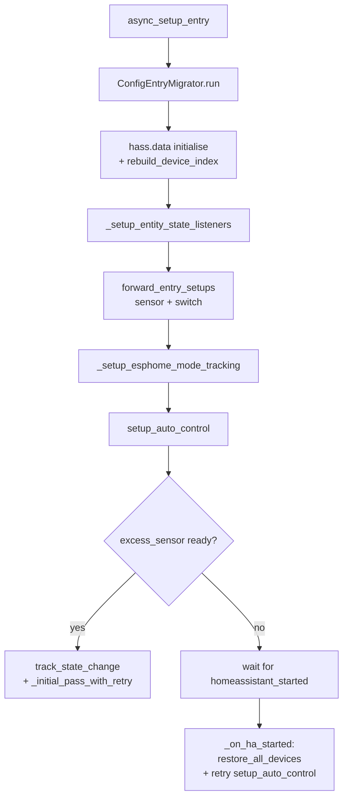
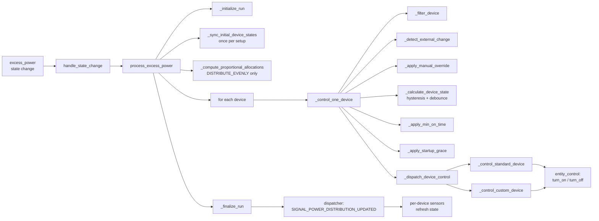

[🇬🇧 English](./architecture.md) | [🇺🇦 Українська](./architecture_uk.md)

# SunAllocator Architecture

Internal architecture overview for contributors. End users only need [Configuration](./configuration.md) and [Concepts](./concepts.md).

## Module Layout

```
custom_components/sun_allocator/
├── __init__.py            # Entry setup/unload, listeners, service registration
├── const.py               # User-facing config keys, defaults, enum values
├── config_flow.py         # Top-level UI flow router
├── manifest.json          # Integration metadata (HA reads this)
├── services.yaml          # Service schemas exposed to HA users
├── translations/          # en.json, uk.json
├── config/                # Config & options flow steps (split by section)
│   ├── device_config.py           # Device add/edit form
│   ├── solar_config.py            # Solar panel form
│   ├── advanced_config.py         # MPPT / hysteresis / strategy
│   ├── temperature_config.py      # Temperature compensation
│   └── *_form.py                  # Voluptuous schemas only
├── core/                  # Runtime logic (no HA-platform classes)
│   ├── power_processor.py         # Main allocation loop
│   ├── entity_control.py          # turn_on / turn_off / set_power / set_mode
│   ├── device_restore.py          # Persistent storage for state + grace deadlines
│   ├── mode_select.py             # ESPHome mode select reconciler
│   ├── schedule.py                # Time/helper-based schedule check
│   ├── solar_optimizer.py         # MPPT / current_max_power math
│   ├── watchdog.py                # Stale-sensor fail-safe
│   ├── services.py                # set_relay_mode / set_relay_power handlers + device index
│   ├── migrations.py              # ConfigEntryMigrator (versioned data migrations)
│   ├── settings.py                # Internal tunables (constants)
│   ├── constants_internal.py      # Shared internal sets (e.g. SUPPORTED_DOMAINS)
│   └── logger.py                  # Logging + journal/audit hooks
├── sensor/                # `sensor` platform
│   ├── __init__.py                # Platform setup; instantiates entities
│   ├── utils.py                   # Excess/usage math, status resolver
│   └── sensors/                   # One file per entity class
│       ├── base_device.py         # BaseSunAllocatorDeviceSensor
│       ├── excess.py              # excess_power
│       ├── current_max_power.py
│       ├── max_power.py
│       ├── usage_percent.py
│       ├── power_distribution.py  # Aggregate + per-device diagnostics
│       ├── device_power_alloc.py  # Per-device W
│       ├── device_power_percent.py# Per-device %
│       └── device_status.py       # Per-device ENUM state
└── switch/
    ├── __init__.py                # Platform setup
    └── auto_control_switch.py     # Per-device runtime auto-control toggle
```

## Setup Lifecycle



## Allocation Cycle (Hot Path)

Triggered every time the excess-power sensor updates its value.



## Storage Layout

### `entry_data` (in-memory, `hass.data[DOMAIN][entry_id]`)

| Key | Type | Purpose |
|---|---|---|
| `config` | `dict` | Snapshot of `config_entry.data`, refreshed on update_listener |
| `device_status` | `dict[device_id, dict]` | Latest per-device status (mode, refusals, retries, etc.) |
| `device_on_state` | `dict[device_id, bool]` | Last computed on/off, drives hysteresis |
| `device_debounce_state` | `dict[device_id, dict]` | Debounce timer state per device |
| `device_on_time_state` | `dict[device_id, dict]` | `last_on_time`, `last_off_time`, `startup_until` |
| `manual_overrides` | `dict[device_id, dict]` | Active manual override (`since`, `state`) |
| `command_retries` | `dict[device_id, dict]` | Retry counters for unresponsive devices |
| `device_retry_failed` | `dict[device_id, bool]` | Marker after RETRY_MAX_ATTEMPTS exceeded |
| `last_controlled_at` | `dict[device_id, datetime]` | Timestamp of last allocator-issued command |
| `auto_control_switches` | `dict[device_id, SwitchEntity]` | Live entity refs for sync |
| `power_allocation` | `dict[device_id, float]` | Latest watt allocation |
| `power_distribution` | `dict` | Snapshot for `power_distribution` sensor |
| `unsub_*` | `Callable` | HA listener unsubscribers; cleared on unload |
| `_device_index` (root, not per-entry) | `dict[device_id, entry_id]` | Cache for `services.py` |

### Persistent storage (`hass.helpers.storage.Store`)

Single store per config entry: `sun_allocator_<entry_id>_restore`.

| Key | Shape | Written by |
|---|---|---|
| `<entity_id>` | `{last_percent, _restore_on, last_mode}` | `persist_device_state`, `persist_mode_state` |
| `_grace_state` | `{device_id: iso_datetime}` | `persist_grace_state` (PR1 in v1.0.6) |

## Adding a Migration

When the shape of `config_entry.data` changes between releases:

1. Open `core/migrations.py`.
2. Add a method `_migrate_<short_name>(self, data: dict) -> dict` to `ConfigEntryMigrator`.
3. Tag it with `"""Added in vX.Y.Z."""` so future maintainers know when it can be removed.
4. Call it from `run()` after prior migrations.
5. Set `self.changed = True` only when data was actually rewritten.

The migrator runs once at the start of every `async_setup_entry`. It is idempotent — re-running on already-migrated data is a no-op.

## Key Conventions

- **No HA imports in `core/`** when avoidable — keeps modules unit-testable.
- **All log calls** go through `core/logger.py` (`log_info`/`log_debug`/`log_warning`/`log_error`) so `LOG_DEVICE_ACTIONS` and journal hooks stay consistent.
- **Internal magic constants** live in `core/settings.py`; user-facing keys live in `const.py`.
- **Entity IDs with hvac_mode** are stored as `climate.x|heat`. Always parse via `entity_control.parse_relay_entity` (returns `(entity_id, hvac_mode)`).
- **Per-device entities** inherit from `sensor/sensors/base_device.BaseSunAllocatorDeviceSensor` to share `device_info` and the dispatcher subscription.
- **Switch state precedence on startup**: `RestoreEntity` (last user action) > `CONF_AUTO_CONTROL_ENABLED` from config.
- **Migrations**: never remove a migration method until you are confident every install has run it at least once (i.e. minimum supported integration version is past it).
