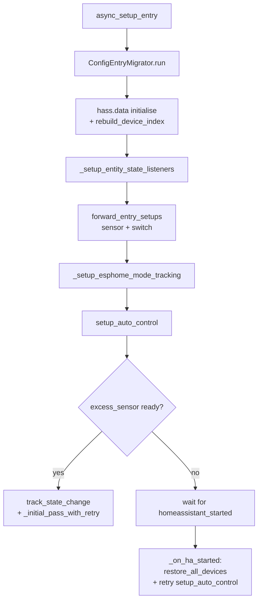
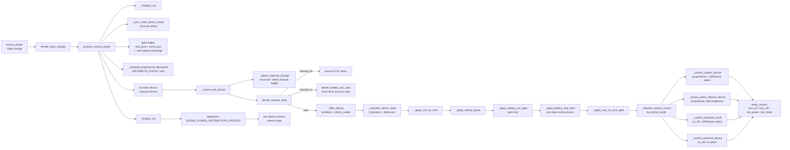

[🇬🇧 English](./architecture.md) | [🇺🇦 Українська](./architecture_uk.md)

# SunAllocator Architecture

Internal architecture overview for contributors. End users only need [Configuration](./configuration.md) and [Concepts](./concepts.md).

## Module Layout

```
custom_components/sun_allocator/
├── __init__.py            # Entry setup/unload, listeners, service registration
├── const.py               # User-facing config keys, defaults, enum values
├── config_flow.py         # Top-level UI flow router
├── manifest.json          # Integration metadata (HA reads this)
├── services.yaml          # Service schemas exposed to HA users
├── translations/          # en.json, uk.json
├── config/                # Config & options flow steps (split by section)
│   ├── device_config.py           # Device add/edit flow (name → basic → advanced → schedule)
│   ├── solar_config.py            # Solar hub + shared Battery page (SolarConfigMixin)
│   ├── advanced_config.py         # Calculation method / hysteresis / strategy
│   ├── temperature_config.py      # Temperature compensation
│   └── *_form.py                  # Voluptuous schemas only
├── core/                  # Runtime logic (no HA-platform classes)
│   ├── power_processor.py         # Main allocation loop + pure decision helpers
│   ├── probe.py                   # Active probe / forecast headroom planner
│   ├── entity_control.py          # turn_on / turn_off / set_power / set_mode
│   ├── device_restore.py          # Persistent storage for state + grace deadlines
│   ├── mode_select.py             # ESPHome mode select reconciler
│   ├── schedule.py                # Time/helper-based schedule check
│   ├── solar_optimizer.py         # MPPT / current_max_power math
│   ├── watchdog.py                # Stale-sensor fail-safe
│   ├── services.py                # set_relay_mode / set_relay_power handlers + device index
│   ├── migrations.py              # ConfigEntryMigrator (versioned data migrations)
│   ├── settings.py                # Internal tunables (constants)
│   ├── constants_internal.py      # Shared internal sets (e.g. SUPPORTED_DOMAINS)
│   └── logger.py                  # Logging + journal/audit hooks
├── sensor/                # `sensor` platform
│   ├── __init__.py                # Platform setup; instantiates entities
│   ├── utils.py                   # Excess/usage math, status resolver
│   └── sensors/                   # One file per entity class
│       ├── base_device.py         # BaseSunAllocatorDeviceSensor
│       ├── excess.py              # excess_power
│       ├── current_max_power.py
│       ├── max_power.py
│       ├── usage_percent.py
│       ├── power_distribution.py  # Aggregate + per-device diagnostics
│       ├── device_power_alloc.py  # Per-device W
│       ├── device_power_percent.py# Per-device %
│       └── device_status.py       # Per-device ENUM state
└── switch/
    ├── __init__.py                # Platform setup
    └── auto_control_switch.py     # Per-device runtime auto-control toggle
```

## Setup Lifecycle


```mermaid
flowchart TD
    A[async_setup_entry] --> B[ConfigEntryMigrator.run]
    B --> C[hass.data initialise<br/>+ rebuild_device_index]
    C --> D[_setup_entity_state_listeners]
    D --> E[forward_entry_setups<br/>sensor + switch]
    E --> F[_setup_esphome_mode_tracking]
    F --> G[setup_auto_control]
    G --> H{excess_sensor ready?}
    H -- yes --> I[track_state_change<br/>+ _initial_pass_with_retry]
    H -- no --> J[wait for homeassistant_started]
    J --> K[_on_ha_started:<br/>restore_all_devices<br/>+ retry setup_auto_control]
```

## Config Flow Structure

The config and options flows are assembled from mixins under `config/`. `SolarConfigMixin`
owns `async_step_battery` — a **shared Battery page** (sensors + reserve / sharing /
protection / discharge tolerance) rendered between the hub step and `mppt_input` in **both**
the initial and options flows (`hub → battery → mppt_input`).

The per-device flow steps are: **name** (`async_step_device_name_type`) → **basic**
(`async_step_device_basic_settings`) → **advanced** (`async_step_device_advanced`, the
fine-tuning page: debounce, min-on-time, per-device stop SOC, `check_usable`, `allow_probe`)
→ **schedule**. The entity picker offers each proportional-capable entity twice — as
`entity|on_off` and `entity|proportional` — and `_process_device_input` maps that suffix to
the stored `control_mode`; `device_type` is kept only for migration back-compat.

## Allocation Cycle (Hot Path)

Triggered every time the excess-power sensor updates its value.


```mermaid
flowchart LR
    EX[excess_power<br/>state change] --> HSC[handle_state_change]
    HSC --> PEP[process_excess_power]
    PEP --> IR[_initialize_run]
    PEP --> SI[_sync_initial_device_states<br/>once per setup]
    PEP --> BUD[split budget:<br/>real_pool + extra_pool<br/>+ read battery discharge]
    PEP --> CPA[_compute_proportional_allocations<br/>DISTRIBUTE_EVENLY only]
    PEP --> LOOP[for each device<br/>manual-ON first]
    LOOP --> COD[_control_one_device]
    COD --> DEC[_detect_external_change<br/>reconcile / detect manual toggle]
    COD --> DMS[decide_manual_state]
    DMS -- manual_off --> RET0[account 0 W, return]
    DMS -- manual_on --> BSS[decide_battery_soc_stop<br/>force-off or account draw]
    DMS -- auto --> FD[_filter_device<br/>schedule + check_usable]
    FD --> CDS[_calculate_device_state<br/>hysteresis + debounce]
    CDS --> AMOT[_apply_min_on_time]
    AMOT --> ASG[_apply_startup_grace]
    ASG --> SG[_apply_battery_soc_gate<br/>start-only]
    SG --> SF[_apply_battery_stop_floor<br/>can stop running device]
    SF --> MOT[_apply_max_on_time_gate]
    MOT --> DDC[_dispatch_device_control<br/>by control_mode]
    DDC --> CCD[_control_custom_device<br/>proportional + ESPHome select]
    DDC --> CND[_control_native_dimmer_device<br/>proportional, light brightness]
    DDC --> CEO[_control_esphome_onoff<br/>on_off + ESPHome select]
    DDC --> CSD[_control_standard_device<br/>on_off, no select]
    CCD --> EC[entity_control:<br/>turn_on / turn_off / set_power / set_mode]
    CND --> EC
    CEO --> EC
    CSD --> EC
    PEP --> FR[_finalize_run]
    FR --> DS[dispatcher:<br/>SIGNAL_POWER_DISTRIBUTION_UPDATED]
    DS --> SENS[per-device sensors<br/>refresh state]
```

### Per-device pipeline order (`_control_one_device`)

The reconcile / manual branch runs **before** the schedule + `check_usable` filter,
so a manual toggle overrides them:

1. **Reconcile external change** (`_detect_external_change`) — detect a user's manual
   toggle (records a sticky manual override) or an unresponsive device (retry / give up).
2. **Classify manual state** (`decide_manual_state` → `auto` / `manual_off` / `manual_on`):
   - `manual_off` — hold the device OFF, account 0 W, and return.
   - `manual_on` — apply battery-protection force-off (`decide_battery_soc_stop`); if it
     does not trip, account the user-forced draw and return (bypassing the schedule /
     usable filter — the user owns the relay, so it is not re-commanded).
3. **Auto path only** (no active override):
   - `_filter_device` — schedule + `check_usable` template;
   - `_calculate_device_state` — hysteresis + debounce;
   - `_apply_min_on_time` → `_apply_startup_grace`;
   - `_apply_battery_soc_gate` — **START-only** SOC gate (never turns a running device off);
   - `_apply_battery_stop_floor` — discharge-side floor that **can turn off a running
     device** (discharge-gated per-device stop SOC plus the absolute protection floor);
   - `_apply_max_on_time_gate` — daily on-time budget;
   - `_dispatch_device_control`.

### Control routing (`_dispatch_device_control`)

Routing is by the device's stored **`control_mode`** (`on_off` | `proportional`),
paired with whether an ESPHome mode-select entity was auto-discovered — not by any
device-type enum:

| `control_mode` | ESPHome mode-select | Handler | Action |
|---|---|---|---|
| `proportional` | present | `_control_custom_device` | set select to `Proportional` + brightness |
| `proportional` | none | `_control_native_dimmer_device` | `light.turn_on` with `brightness` |
| `on_off` | present | `_control_esphome_onoff` | set select `On` / `Off` |
| `on_off` | none | `_control_standard_device` | `turn_on` / `turn_off` |

The config flow derives `control_mode` from the entity-picker mode suffix
(`entity|on_off` / `entity|proportional`); the ESPHome light+select pairing is
auto-discovered via the entity / device registry (`find_esphome_mode_select`).

### Pure decision helpers

`core/power_processor.py` exposes hass-free helpers that are unit-tested in isolation:

- `decide_manual_state(override)` — classifies the manual-override entry.
- `decide_battery_soc_stop(battery_soc, soc_configured, discharging, stop_soc,
  protection_soc, was_blocked, hysteresis)` — the single source of truth for
  battery-protection force-off, called by **both** the manual (`manual_on`) and auto
  (`_apply_battery_stop_floor`) paths.

### Probe / forecast budget

Active probing / forecast guidance (`core/probe.py`) is enabled when the calculation
method is `mppt_probe`, **or** when it is `mppt` and a PV-production forecast is present.
The probe timer grows a stored `probe_headroom_w` (the discovered sustainable
controllable-load budget), backing it off when the battery discharges. Each cycle the
allocator splits the budget into two pools:

- **real_pool** — the cautious excess, genuinely available and usable by **all** devices;
- **extra_pool** — the probe-discovered surplus beyond the cautious excess, usable **only**
  by devices with `allow_probe` enabled.

The total equals `max(excess, probe_headroom_w)`. Battery discharge / net-charge is read
once per cycle and passed into the control loop to drive the discharge-side stop floor.

## Storage Layout

### `entry_data` (in-memory, `hass.data[DOMAIN][entry_id]`)

| Key | Type | Purpose |
|---|---|---|
| `config` | `dict` | Snapshot of `config_entry.data`, refreshed on update_listener |
| `device_status` | `dict[device_id, dict]` | Latest per-device status (mode, refusals, retries, etc.) |
| `device_on_state` | `dict[device_id, bool]` | Last computed on/off, drives hysteresis |
| `device_debounce_state` | `dict[device_id, dict]` | Debounce timer state per device |
| `device_on_time_state` | `dict[device_id, dict]` | `last_on_time`, `last_off_time`, `startup_until` |
| `manual_overrides` | `dict[device_id, dict]` | Sticky manual override (`since`, `state`); no TTL — cleared on daily rollover, auto-control re-toggle, or battery-protection force-off |
| `command_retries` | `dict[device_id, dict]` | Retry counters for unresponsive devices |
| `device_retry_failed` | `dict[device_id, bool]` | Marker after RETRY_MAX_ATTEMPTS exceeded |
| `battery_soc_gate_state` | `dict[device_id, bool]` | Sticky START-gate block flag for SOC hysteresis |
| `battery_stop_gate_state` | `dict[device_id, bool]` | Sticky stop-floor block flag (shared by manual + auto paths) |
| `probe_headroom_w` | `float` | Probe-discovered sustainable controllable-load budget |
| `probe_state` | `dict` | Probe planner state between ticks |
| `probe_battery_healthy` | `bool` | Set by the probe tick; gates the race-free budget floor |
| `last_controlled_at` | `dict[device_id, datetime]` | Timestamp of last allocator-issued command |
| `auto_control_switches` | `dict[device_id, SwitchEntity]` | Live entity refs for sync |
| `power_allocation` | `dict[device_id, float]` | Latest watt allocation |
| `power_distribution` | `dict` | Snapshot for `power_distribution` sensor |
| `unsub_*` | `Callable` | HA listener unsubscribers (incl. `unsub_probe_timer`); cleared on unload |
| `_device_index` (root, not per-entry) | `dict[device_id, entry_id]` | Cache for `services.py` |

### Persistent storage (`hass.helpers.storage.Store`)

Single store per config entry: `sun_allocator_<entry_id>_restore`.

| Key | Shape | Written by |
|---|---|---|
| `<entity_id>` | `{last_percent, _restore_on, last_mode}` | `persist_device_state`, `persist_mode_state` |
| `_grace_state` | `{device_id: iso_datetime}` | `persist_grace_state` (PR1 in v1.0.6) |

## Adding a Migration

When the shape of `config_entry.data` changes between releases:

1. Open `core/migrations.py`.
2. Add a method `_migrate_<short_name>(self, data: dict) -> dict` to `ConfigEntryMigrator`.
3. Tag it with `"""Added in vX.Y.Z."""` so future maintainers know when it can be removed.
4. Call it from `run()` after prior migrations.
5. Set `self.changed = True` only when data was actually rewritten.

The migrator runs once at the start of every `async_setup_entry`. It is idempotent — re-running on already-migrated data is a no-op.

## Key Conventions

- **No HA imports in `core/`** when avoidable — keeps modules unit-testable.
- **All log calls** go through `core/logger.py` (`log_info`/`log_debug`/`log_warning`/`log_error`) so `LOG_DEVICE_ACTIONS` and journal hooks stay consistent.
- **Internal magic constants** live in `core/settings.py`; user-facing keys live in `const.py`.
- **Entity IDs with hvac_mode** are stored as `climate.x|heat`. Always parse via `entity_control.parse_relay_entity` (returns `(entity_id, hvac_mode)`).
- **Per-device entities** inherit from `sensor/sensors/base_device.BaseSunAllocatorDeviceSensor` to share `device_info` and the dispatcher subscription.
- **Switch state precedence on startup**: `RestoreEntity` (last user action) > `CONF_AUTO_CONTROL_ENABLED` from config.
- **Migrations**: never remove a migration method until you are confident every install has run it at least once (i.e. minimum supported integration version is past it).
