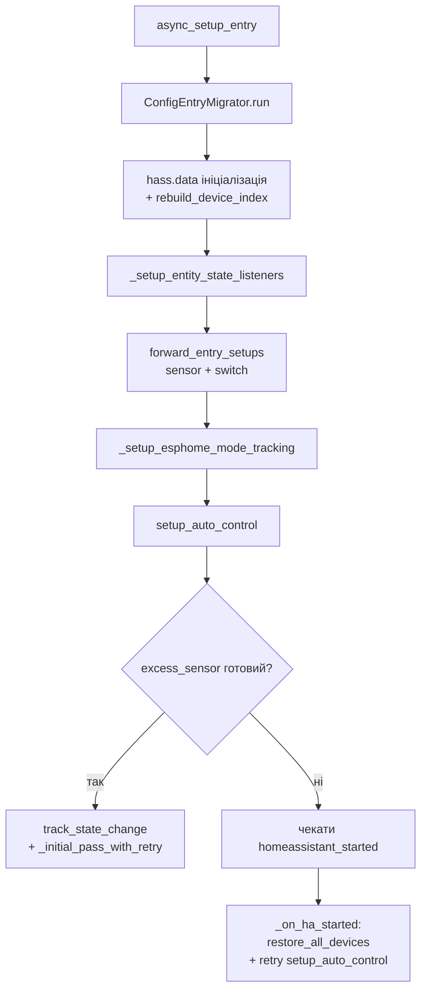
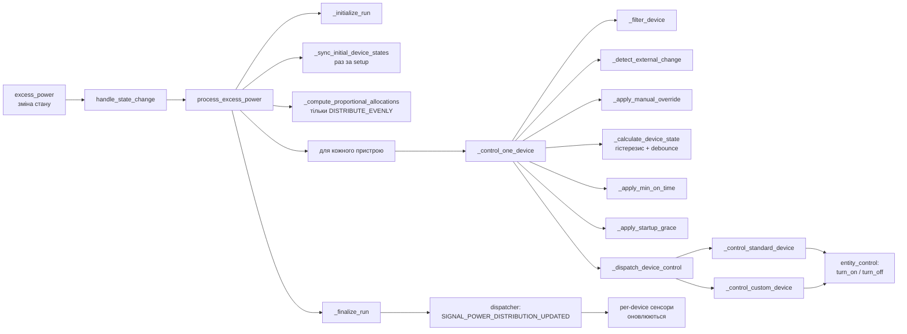

[🇬🇧 English](./architecture.md) | [🇺🇦 Українська](./architecture_uk.md)

# Архітектура SunAllocator

Огляд внутрішньої архітектури для контрибуторів. Кінцевим користувачам потрібні лише [Конфігурація](./configuration_uk.md) та [Концепції](./concepts_uk.md).

## Розкладка модулів

```
custom_components/sun_allocator/
├── __init__.py            # Setup/unload entry, listeners, реєстрація сервісів
├── const.py               # Публічні config-ключі, defaults, enum-значення
├── config_flow.py         # Top-level UI flow router
├── manifest.json          # Метадані інтеграції (читає HA)
├── services.yaml          # Схеми сервісів для користувачів
├── translations/          # en.json, uk.json
├── config/                # Кроки config & options flow (по секціях)
│   ├── device_config.py           # Форма додавання/редагування пристрою
│   ├── solar_config.py            # Форма сонячних панелей
│   ├── advanced_config.py         # MPPT / гістерезис / стратегія
│   ├── temperature_config.py      # Температурна компенсація
│   └── *_form.py                  # Тільки voluptuous схеми
├── core/                  # Runtime-логіка (без HA-platform класів)
│   ├── power_processor.py         # Головний цикл алокації
│   ├── entity_control.py          # turn_on / turn_off / set_power / set_mode
│   ├── device_restore.py          # Persistent storage для стану + grace
│   ├── mode_select.py             # Ресинхронізатор mode_select ESPHome
│   ├── schedule.py                # Перевірка розкладу (час/хелпер)
│   ├── solar_optimizer.py         # MPPT / current_max_power
│   ├── watchdog.py                # Stale-sensor fail-safe
│   ├── services.py                # Хендлери set_relay_mode/power + device index
│   ├── migrations.py              # ConfigEntryMigrator (версіоновані міграції)
│   ├── settings.py                # Внутрішні tunables (константи)
│   ├── constants_internal.py      # Спільні внутрішні множини (наприклад, SUPPORTED_DOMAINS)
│   └── logger.py                  # Логування + journal/audit hooks
├── sensor/                # Платформа `sensor`
│   ├── __init__.py                # Setup, інстанціація сутностей
│   ├── utils.py                   # Excess/usage math, status resolver
│   └── sensors/                   # Один файл — один клас сутності
│       ├── base_device.py         # BaseSunAllocatorDeviceSensor
│       ├── excess.py              # excess_power
│       ├── current_max_power.py
│       ├── max_power.py
│       ├── usage_percent.py
│       ├── power_distribution.py  # Агрегат + per-device діагностика
│       ├── device_power_alloc.py  # Per-device W
│       ├── device_power_percent.py# Per-device %
│       └── device_status.py       # Per-device ENUM стан
└── switch/
    ├── __init__.py                # Setup платформи
    └── auto_control_switch.py     # Per-device runtime auto-control toggle
```

## Lifecycle setup



## Цикл алокації (hot path)

Тригериться кожен раз коли сенсор excess-power оновлює значення.



## Розкладка storage

### `entry_data` (in-memory, `hass.data[DOMAIN][entry_id]`)

| Ключ | Тип | Призначення |
|---|---|---|
| `config` | `dict` | Snapshot `config_entry.data`, оновлюється у update_listener |
| `device_status` | `dict[device_id, dict]` | Останній статус на пристрій (mode, refusals, retries...) |
| `device_on_state` | `dict[device_id, bool]` | Last on/off, керує гістерезисом |
| `device_debounce_state` | `dict[device_id, dict]` | Debounce-таймер на пристрій |
| `device_on_time_state` | `dict[device_id, dict]` | `last_on_time`, `last_off_time`, `startup_until` |
| `manual_overrides` | `dict[device_id, dict]` | Активне ручне перевизначення (`since`, `state`) |
| `command_retries` | `dict[device_id, dict]` | Лічильники retry для нечутливих пристроїв |
| `device_retry_failed` | `dict[device_id, bool]` | Маркер після перевищення RETRY_MAX_ATTEMPTS |
| `last_controlled_at` | `dict[device_id, datetime]` | Час останньої команди від allocator |
| `auto_control_switches` | `dict[device_id, SwitchEntity]` | Живі ref на сутності для синку |
| `power_allocation` | `dict[device_id, float]` | Останнє значення алокації у Вт |
| `power_distribution` | `dict` | Snapshot для сенсора `power_distribution` |
| `unsub_*` | `Callable` | HA listener unsubscribers; чистяться на unload |
| `_device_index` (root, не per-entry) | `dict[device_id, entry_id]` | Кеш для `services.py` |

### Persistent storage (`hass.helpers.storage.Store`)

Один store на config entry: `sun_allocator_<entry_id>_restore`.

| Ключ | Форма | Пишеться |
|---|---|---|
| `<entity_id>` | `{last_percent, _restore_on, last_mode}` | `persist_device_state`, `persist_mode_state` |
| `_grace_state` | `{device_id: iso_datetime}` | `persist_grace_state` (PR1 у v1.0.6) |

## Як додати міграцію

Коли форма `config_entry.data` змінюється між релізами:

1. Відкрити `core/migrations.py`.
2. Додати метод `_migrate_<short_name>(self, data: dict) -> dict` у `ConfigEntryMigrator`.
3. Позначити docstring `"""Added in vX.Y.Z."""` — щоб майбутні мейнтейнери знали коли можна видалити.
4. Викликати з `run()` після попередніх міграцій.
5. Ставити `self.changed = True` лише коли реально щось переписали.

Міграція виконується раз на кожен `async_setup_entry`. Ідемпотентна — повторний запуск на вже-міграційованих даних = no-op.

## Ключові конвенції

- **Без HA-імпортів у `core/`** там де можливо — тримає модулі unit-тестабельними.
- **Усе логування** через `core/logger.py` (`log_info`/`log_debug`/`log_warning`/`log_error`) — щоб `LOG_DEVICE_ACTIONS` і journal-hooks лишались консистентні.
- **Внутрішні magic-константи** живуть у `core/settings.py`; user-facing ключі — у `const.py`.
- **Entity ID з hvac_mode** зберігаються як `climate.x|heat`. Парсити завжди через `entity_control.parse_relay_entity` (повертає `(entity_id, hvac_mode)`).
- **Per-device сутності** наслідують від `sensor/sensors/base_device.BaseSunAllocatorDeviceSensor` — спільне `device_info` та dispatcher subscription.
- **Пріоритет стану світча на старті**: `RestoreEntity` (остання дія користувача) > `CONF_AUTO_CONTROL_ENABLED` з конфіга.
- **Міграції**: ніколи не видаляйте метод міграції до того як упевнені що кожен інстал її виконав хоча б раз (тобто мінімальна підтримувана версія інтеграції вища за неї).
