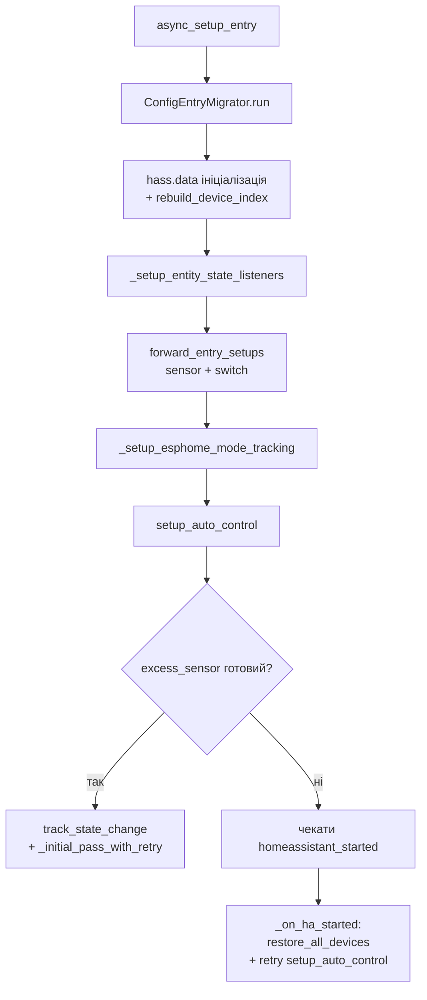
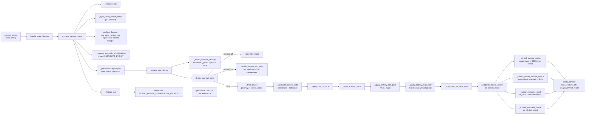

[🇬🇧 English](./architecture.md) | [🇺🇦 Українська](./architecture_uk.md)

# Архітектура SunAllocator

Огляд внутрішньої архітектури для контрибуторів. Кінцевим користувачам потрібні лише [Конфігурація](./configuration_uk.md) та [Концепції](./concepts_uk.md).

## Розкладка модулів

```
custom_components/sun_allocator/
├── __init__.py            # Setup/unload entry, listeners, реєстрація сервісів
├── const.py               # Публічні config-ключі, defaults, enum-значення
├── config_flow.py         # Top-level UI flow router
├── manifest.json          # Метадані інтеграції (читає HA)
├── services.yaml          # Схеми сервісів для користувачів
├── translations/          # en.json, uk.json
├── config/                # Кроки config & options flow (по секціях)
│   ├── device_config.py           # Flow пристрою (name → basic → advanced → schedule)
│   ├── solar_config.py            # Хаб сонячних панелей + спільна сторінка Battery (SolarConfigMixin)
│   ├── advanced_config.py         # Метод розрахунку / гістерезис / стратегія
│   ├── temperature_config.py      # Температурна компенсація
│   └── *_form.py                  # Тільки voluptuous схеми
├── core/                  # Runtime-логіка (без HA-platform класів)
│   ├── power_processor.py         # Головний цикл алокації + чисті decision-хелпери
│   ├── probe.py                   # Планувальник headroom активного probe / forecast
│   ├── entity_control.py          # turn_on / turn_off / set_power / set_mode
│   ├── device_restore.py          # Persistent storage для стану + grace
│   ├── mode_select.py             # Ресинхронізатор mode_select ESPHome
│   ├── schedule.py                # Перевірка розкладу (час/хелпер)
│   ├── solar_optimizer.py         # MPPT / current_max_power
│   ├── watchdog.py                # Stale-sensor fail-safe
│   ├── services.py                # Хендлери set_relay_mode/power + device index
│   ├── migrations.py              # ConfigEntryMigrator (версіоновані міграції)
│   ├── settings.py                # Внутрішні tunables (константи)
│   ├── constants_internal.py      # Спільні внутрішні множини (наприклад, SUPPORTED_DOMAINS)
│   └── logger.py                  # Логування + journal/audit hooks
├── sensor/                # Платформа `sensor`
│   ├── __init__.py                # Setup, інстанціація сутностей
│   ├── utils.py                   # Excess/usage math, status resolver
│   └── sensors/                   # Один файл — один клас сутності
│       ├── base_device.py         # BaseSunAllocatorDeviceSensor
│       ├── excess.py              # excess_power
│       ├── current_max_power.py
│       ├── max_power.py
│       ├── usage_percent.py
│       ├── power_distribution.py  # Агрегат + per-device діагностика
│       ├── device_power_alloc.py  # Per-device W
│       ├── device_power_percent.py# Per-device %
│       └── device_status.py       # Per-device ENUM стан
└── switch/
    ├── __init__.py                # Setup платформи
    └── auto_control_switch.py     # Per-device runtime auto-control toggle
```

## Lifecycle setup


```mermaid
flowchart TD
    A[async_setup_entry] --> B[ConfigEntryMigrator.run]
    B --> C[hass.data ініціалізація<br/>+ rebuild_device_index]
    C --> D[_setup_entity_state_listeners]
    D --> E[forward_entry_setups<br/>sensor + switch]
    E --> F[_setup_esphome_mode_tracking]
    F --> G[setup_auto_control]
    G --> H{excess_sensor готовий?}
    H -- так --> I[track_state_change<br/>+ _initial_pass_with_retry]
    H -- ні --> J[чекати homeassistant_started]
    J --> K[_on_ha_started:<br/>restore_all_devices<br/>+ retry setup_auto_control]
```

## Структура config flow

Config і options flow збираються з міксинів у `config/`. `SolarConfigMixin` володіє
`async_step_battery` — **спільною сторінкою Battery** (сенсори + reserve / sharing /
protection / discharge tolerance), яка рендериться між кроком хаба та `mppt_input` в
**обох** flow — початковому та options (`hub → battery → mppt_input`).

Кроки per-device flow: **name** (`async_step_device_name_type`) → **basic**
(`async_step_device_basic_settings`) → **advanced** (`async_step_device_advanced` — сторінка
тонкого налаштування: debounce, min-on-time, per-device stop SOC, `check_usable`,
`allow_probe`) → **schedule**. Пікер сутностей показує кожну proportional-здатну сутність
двічі — як `entity|on_off` та `entity|proportional` — а `_process_device_input` мапить цей
суфікс у збережений `control_mode`; `device_type` лишається лише для back-compat міграцій.

## Цикл алокації (hot path)

Тригериться кожен раз коли сенсор excess-power оновлює значення.


```mermaid
flowchart LR
    EX[excess_power<br/>зміна стану] --> HSC[handle_state_change]
    HSC --> PEP[process_excess_power]
    PEP --> IR[_initialize_run]
    PEP --> SI[_sync_initial_device_states<br/>раз за setup]
    PEP --> BUD[розбити бюджет:<br/>real_pool + extra_pool<br/>+ прочитати розряд батареї]
    PEP --> CPA[_compute_proportional_allocations<br/>тільки DISTRIBUTE_EVENLY]
    PEP --> LOOP[для кожного пристрою<br/>manual-ON першими]
    LOOP --> COD[_control_one_device]
    COD --> DEC[_detect_external_change<br/>reconcile / детект ручного тогла]
    COD --> DMS[decide_manual_state]
    DMS -- manual_off --> RET0[облік 0 Вт, return]
    DMS -- manual_on --> BSS[decide_battery_soc_stop<br/>force-off або облік споживання]
    DMS -- auto --> FD[_filter_device<br/>розклад + check_usable]
    FD --> CDS[_calculate_device_state<br/>гістерезис + debounce]
    CDS --> AMOT[_apply_min_on_time]
    AMOT --> ASG[_apply_startup_grace]
    ASG --> SG[_apply_battery_soc_gate<br/>тільки старт]
    SG --> SF[_apply_battery_stop_floor<br/>може вимкнути активний]
    SF --> MOT[_apply_max_on_time_gate]
    MOT --> DDC[_dispatch_device_control<br/>за control_mode]
    DDC --> CCD[_control_custom_device<br/>proportional + ESPHome select]
    DDC --> CND[_control_native_dimmer_device<br/>proportional, яскравість light]
    DDC --> CEO[_control_esphome_onoff<br/>on_off + ESPHome select]
    DDC --> CSD[_control_standard_device<br/>on_off, без select]
    CCD --> EC[entity_control:<br/>turn_on / turn_off / set_power / set_mode]
    CND --> EC
    CEO --> EC
    CSD --> EC
    PEP --> FR[_finalize_run]
    FR --> DS[dispatcher:<br/>SIGNAL_POWER_DISTRIBUTION_UPDATED]
    DS --> SENS[per-device сенсори<br/>оновлюються]
```

### Порядок per-device pipeline (`_control_one_device`)

Гілка reconcile / manual виконується **перед** фільтром розкладу + `check_usable`,
тому ручний тогл їх перевизначає:

1. **Reconcile external change** (`_detect_external_change`) — детект ручного тогла
   користувача (записує sticky manual override) або нечутливого пристрою (retry / give up).
2. **Класифікація ручного стану** (`decide_manual_state` → `auto` / `manual_off` /
   `manual_on`):
   - `manual_off` — тримати пристрій OFF, облік 0 Вт, return.
   - `manual_on` — застосувати battery-protection force-off (`decide_battery_soc_stop`); якщо
     не спрацював — облік ручного споживання і return (в обхід фільтра розкладу / usable —
     реле належить користувачу, тому команда не переповторюється).
3. **Тільки auto-шлях** (немає активного override):
   - `_filter_device` — розклад + шаблон `check_usable`;
   - `_calculate_device_state` — гістерезис + debounce;
   - `_apply_min_on_time` → `_apply_startup_grace`;
   - `_apply_battery_soc_gate` — SOC-гейт **тільки на СТАРТ** (ніколи не вимикає активний);
   - `_apply_battery_stop_floor` — floor з боку розряду, який **може вимкнути активний
     пристрій** (per-device stop SOC, gated по розряду, плюс абсолютний protection floor);
   - `_apply_max_on_time_gate` — денний бюджет часу роботи;
   - `_dispatch_device_control`.

### Роутинг керування (`_dispatch_device_control`)

Роутинг — за збереженим **`control_mode`** пристрою (`on_off` | `proportional`), у парі з тим,
чи авто-виявлено сутність ESPHome mode-select — а не за якимось device-type enum:

| `control_mode` | ESPHome mode-select | Хендлер | Дія |
|---|---|---|---|
| `proportional` | є | `_control_custom_device` | select у `Proportional` + яскравість |
| `proportional` | немає | `_control_native_dimmer_device` | `light.turn_on` з `brightness` |
| `on_off` | є | `_control_esphome_onoff` | select `On` / `Off` |
| `on_off` | немає | `_control_standard_device` | `turn_on` / `turn_off` |

Config flow виводить `control_mode` із суфікса режиму в пікері сутностей
(`entity|on_off` / `entity|proportional`); пара ESPHome light+select авто-виявляється через
entity / device registry (`find_esphome_mode_select`).

### Чисті decision-хелпери

`core/power_processor.py` надає hass-free хелпери, які unit-тестуються ізольовано:

- `decide_manual_state(override)` — класифікує запис manual-override.
- `decide_battery_soc_stop(battery_soc, soc_configured, discharging, stop_soc,
  protection_soc, was_blocked, hysteresis)` — єдине джерело істини для battery-protection
  force-off, викликається **обома** шляхами: manual (`manual_on`) і auto
  (`_apply_battery_stop_floor`).

### Бюджет probe / forecast

Активний probe / forecast-керування (`core/probe.py`) вмикається, коли метод розрахунку —
`mppt_probe`, **або** коли це `mppt` і присутній forecast PV-виробітку. Таймер probe
нарощує збережений `probe_headroom_w` (виявлений стійкий бюджет керованого навантаження),
відкочуючи його при розряді батареї. Кожен цикл алокатор розбиває бюджет на два пули:

- **real_pool** — обережний excess, реально доступний, використовуваний **усіма** пристроями;
- **extra_pool** — виявлений probe надлишок понад обережний excess, доступний **лише**
  пристроям з увімкненим `allow_probe`.

Сума дорівнює `max(excess, probe_headroom_w)`. Розряд / net-charge батареї читається раз за
цикл і передається у цикл керування для floor з боку розряду.

## Розкладка storage

### `entry_data` (in-memory, `hass.data[DOMAIN][entry_id]`)

| Ключ | Тип | Призначення |
|---|---|---|
| `config` | `dict` | Snapshot `config_entry.data`, оновлюється у update_listener |
| `device_status` | `dict[device_id, dict]` | Останній статус на пристрій (mode, refusals, retries...) |
| `device_on_state` | `dict[device_id, bool]` | Last on/off, керує гістерезисом |
| `device_debounce_state` | `dict[device_id, dict]` | Debounce-таймер на пристрій |
| `device_on_time_state` | `dict[device_id, dict]` | `last_on_time`, `last_off_time`, `startup_until` |
| `manual_overrides` | `dict[device_id, dict]` | Sticky ручне перевизначення (`since`, `state`); без TTL — чиститься на добовому rollover, повторному тоглі auto-control або battery-protection force-off |
| `command_retries` | `dict[device_id, dict]` | Лічильники retry для нечутливих пристроїв |
| `device_retry_failed` | `dict[device_id, bool]` | Маркер після перевищення RETRY_MAX_ATTEMPTS |
| `battery_soc_gate_state` | `dict[device_id, bool]` | Sticky прапор блоку START-гейта для гістерезису SOC |
| `battery_stop_gate_state` | `dict[device_id, bool]` | Sticky прапор блоку stop-floor (спільний для manual + auto) |
| `probe_headroom_w` | `float` | Виявлений probe стійкий бюджет керованого навантаження |
| `probe_state` | `dict` | Стан планувальника probe між тіками |
| `probe_battery_healthy` | `bool` | Ставиться тіком probe; гейтить race-free floor бюджету |
| `last_controlled_at` | `dict[device_id, datetime]` | Час останньої команди від allocator |
| `auto_control_switches` | `dict[device_id, SwitchEntity]` | Живі ref на сутності для синку |
| `power_allocation` | `dict[device_id, float]` | Останнє значення алокації у Вт |
| `power_distribution` | `dict` | Snapshot для сенсора `power_distribution` |
| `unsub_*` | `Callable` | HA listener unsubscribers (у т.ч. `unsub_probe_timer`); чистяться на unload |
| `_device_index` (root, не per-entry) | `dict[device_id, entry_id]` | Кеш для `services.py` |

### Persistent storage (`hass.helpers.storage.Store`)

Один store на config entry: `sun_allocator_<entry_id>_restore`.

| Ключ | Форма | Пишеться |
|---|---|---|
| `<entity_id>` | `{last_percent, _restore_on, last_mode}` | `persist_device_state`, `persist_mode_state` |
| `_grace_state` | `{device_id: iso_datetime}` | `persist_grace_state` (PR1 у v1.0.6) |

## Як додати міграцію

Коли форма `config_entry.data` змінюється між релізами:

1. Відкрити `core/migrations.py`.
2. Додати метод `_migrate_<short_name>(self, data: dict) -> dict` у `ConfigEntryMigrator`.
3. Позначити docstring `"""Added in vX.Y.Z."""` — щоб майбутні мейнтейнери знали коли можна видалити.
4. Викликати з `run()` після попередніх міграцій.
5. Ставити `self.changed = True` лише коли реально щось переписали.

Міграція виконується раз на кожен `async_setup_entry`. Ідемпотентна — повторний запуск на вже-міграційованих даних = no-op.

## Ключові конвенції

- **Без HA-імпортів у `core/`** там де можливо — тримає модулі unit-тестабельними.
- **Усе логування** через `core/logger.py` (`log_info`/`log_debug`/`log_warning`/`log_error`) — щоб `LOG_DEVICE_ACTIONS` і journal-hooks лишались консистентні.
- **Внутрішні magic-константи** живуть у `core/settings.py`; user-facing ключі — у `const.py`.
- **Entity ID з hvac_mode** зберігаються як `climate.x|heat`. Парсити завжди через `entity_control.parse_relay_entity` (повертає `(entity_id, hvac_mode)`).
- **Per-device сутності** наслідують від `sensor/sensors/base_device.BaseSunAllocatorDeviceSensor` — спільне `device_info` та dispatcher subscription.
- **Пріоритет стану світча на старті**: `RestoreEntity` (остання дія користувача) > `CONF_AUTO_CONTROL_ENABLED` з конфіга.
- **Міграції**: ніколи не видаляйте метод міграції до того як упевнені що кожен інстал її виконав хоча б раз (тобто мінімальна підтримувана версія інтеграції вища за неї).
