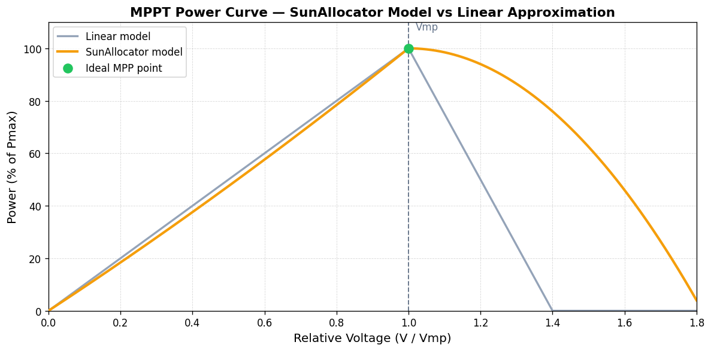

[🇬🇧 English](./concepts.md) | [🇺🇦 Українська](./concepts_uk.md)

# Technical Concepts

This document explains the core concepts and calculations used by the SunAllocator component.

## Excess Power Calculation

The `sun_allocator_excess_power` sensor calculates the untapped potential power that could be extracted from your solar panel. It is calculated as:

```
excess_power = estimated_max_power_at_current_voltage - current_pv_power_output
```

This value represents how many additional watts could be extracted from the panel at its current operating voltage. When this value is high, it indicates that your panel has significant untapped potential that could be utilized with additional loads.

## Understanding MPPT and Solar Panel Operation

Solar panels have a characteristic I-V (current-voltage) curve that determines their power output. The key points to understand:

1.  **Maximum Power Point (MPP)**: This is the optimal operating point where the product of voltage and current is maximized. It occurs at specific voltage (Vmp) and current (Imp) values.

2.  **Operating Regions**:
    *   **Below Vmp**: In this region, the panel operates with relatively constant current. As voltage increases, power increases approximately linearly.
    *   **At Vmp**: This is the optimal operating point where maximum power is produced.
    *   **Above Vmp**: In this region, current drops rapidly as voltage increases, causing power to decrease.

3.  **Excess Possible Indicator**: The `excess_possible` attribute is `true` when your panel's voltage exceeds Vmp. This indicates:
    *   The panel is operating in the constant-voltage region (above Vmp)
    *   Power output is likely less than optimal
    *   An MPPT controller could potentially increase power by reducing voltage to Vmp

4.  **Why it's usually "false"**: Most solar systems with MPPT controllers will operate at or below Vmp to maximize power, so `excess_possible` will typically be "false" during normal operation.

## MPPT-Based Maximum Power Calculation

The `current_max_power` value estimates the maximum power that could be extracted at the current voltage, based on Maximum Power Point Tracking (MPPT) principles. This helps you understand:

1.  How much power your panel could potentially produce at its current operating voltage
2.  Whether you're operating near the optimal voltage for maximum power
3.  How much additional power you could extract with optimal MPPT control

#### Technical Details of the MPPT Algorithm

SunAllocator uses an advanced model to estimate maximum possible power at any voltage:

1.  **Relative Voltage Calculation**:
    ```
    # Series wiring: each panel's voltage adds up
    relative_voltage = measured_pv_voltage_V / (panel_rated_vmp_V * number_of_panels_in_series)

    # Parallel wiring: voltage is the same as a single panel
    relative_voltage = measured_pv_voltage_V / panel_rated_vmp_V
    ```
    A value of `1.0` means the array is operating exactly at Vmp (maximum power point).

2.  **Power Estimation Model**:
    *   For voltage below or at Vmp (`relative_voltage ≤ 1.0`):
        ```
        # Polynomial approximation: slight upward curve toward Vmp,
        # matching the real constant-current region of the I-V curve.
        estimated_max_power_W = panel_rated_pmax_W * (
            relative_voltage * (1.0 - 0.1 * (1.0 - relative_voltage))
        )
        ```

    *   For voltage above Vmp (`relative_voltage > 1.0`):
        ```
        # Quadratic drop-off: power falls rapidly once voltage exceeds Vmp,
        # reflecting the steep decline in current in the constant-voltage region.
        estimated_max_power_W = panel_rated_pmax_W * max(
            0,
            1 - 1.5 * (relative_voltage - 1) ** 2
        )
        ```

3.  **Panel Configuration**:
    The algorithm accounts for different panel arrangements:
    *   **Series**: Voltage adds up, current remains the same
    *   **Parallel**: Current adds up, voltage remains the same


*Comparison of power curves showing how the improved algorithm better matches real-world panel behavior*

---

## Power Allocation Algorithm

This section describes how SunAllocator decides which devices to turn on and how much power to give each one.

### Step 1 — Calculate Excess Power

Each time the PV power sensor updates, SunAllocator calculates how much power is available for distribution:

```
# MPPT Mode (no house consumption sensor — default):
excess_power_W = estimated_max_power_at_current_voltage_W
              - inverter_self_consumption_W   # power the inverter itself uses (from settings)
              - reserved_battery_power_W      # power kept for battery charging (from settings)
```

In **Parallel Mode** (when a house consumption sensor is configured), the excess is:

```
# Parallel Mode — direct measurement of what is truly "spare":
excess_power_W = solar_panel_output_W
              - total_house_consumption_W     # everything the house is currently using
              - battery_charging_power_W      # positive = charging, negative = discharging
              - inverter_self_consumption_W   # inverter idle draw (from settings)
```

A negative excess means the house is drawing from the grid; no devices are turned on.

### Step 2 — Filter Devices

Before any device is considered for allocation, it must pass several checks:

- **Auto-control enabled**: Only devices with auto-control turned on are processed.
- **Entity exists**: The controlled HA entity must be available in Home Assistant.
- **Schedule check**: If the device has a schedule, the current time must be within the allowed window. If the device is currently on but outside its schedule, it is turned off immediately.
- **Manual override**: If the device mode was manually set to `Off` or `On`, the allocator respects that and skips automatic control.

Devices that fail any check are skipped and their filter reason is stored for diagnostics.

### Step 3 — Determine Device State (On/Off Decision)

For each eligible device, the allocator decides whether it should be active using hysteresis thresholds:

```
# Turn-on threshold: device activates when excess covers its rated minimum draw
on_threshold_W  = device_min_expected_W            # e.g. 500 W for a floor heater

# Turn-off threshold: device stays on until power drops well below the turn-on level
# (hysteresis gap prevents flicker when solar output fluctuates around the threshold)
off_threshold_W = device_min_expected_W - global_hysteresis_W   # e.g. 500 - 40 = 460 W
```

- **Turn ON**: if `excess_power_W >= on_threshold_W` AND the device was previously off.
- **Stay ON**: if `excess_power_W >= off_threshold_W` AND the device was previously on.
- **Turn OFF**: if `excess_power_W < off_threshold_W`.

This prevents rapid on/off cycling when solar power fluctuates around the threshold.

**Debounce**: A state change is not applied immediately. The device enters a candidate state and only transitions after the configured debounce time has elapsed without the candidate state changing.

### Step 4 — Minimum On-Time and Startup Grace Period

To protect appliances (compressors, heat pumps, pumps) from rapid cycling:

- **Minimum on-time**: Once a device turns on, it stays on for at least `min_on_time` seconds, even if power drops below the off-threshold.
- **Startup grace period**: When a device first turns on, it gets an additional protective time interval of 90 seconds so that the MPPT has time to reach the highest voltage point (during this time, partial consumption from the battery and/or network is possible).

### Step 5 — Power Allocation

Devices are sorted by **priority** (highest first). The allocator iterates over them and assigns power from the remaining budget:

#### Standard devices (On/Off)

Each active standard device is allocated exactly `min_expected_w` from the budget:

```
# Device gets exactly its configured minimum rated draw
power_allocated_to_device_W  = device_min_expected_W    # e.g. 500 W
remaining_solar_budget_W    -= power_allocated_to_device_W
```

If there is not enough remaining power for a device, it is turned off.

#### Custom devices (Proportional)

The proportional target is calculated based on available power and the device's max capacity:

```
# What fraction of the device's capacity can the current solar output support?
target_percent = clamp(
    5%,    # never go below 5% (avoids flicker at near-zero levels)
    90%,   # cap at 90% (safety headroom)
    (remaining_solar_budget_W / device_max_expected_W) * 100%
)

# Power actually consumed at this target level
power_used_W = min(remaining_solar_budget_W, device_max_expected_W * target_percent / 100%)
```

**Allocation strategies** (configurable in Advanced Settings):
- **Fill one by one**: Each device (highest priority first) gets as much as it needs. Remaining power goes to the next device.
- **Distribute evenly**: Available power is split proportionally among all active proportional devices based on their `max_expected_w`.

A ramp mechanism gradually increases or decreases the power level each cycle by `ramp_step_%`, with a deadband to prevent micro-oscillations.

### Step 6 — Apply State to Entities

After all decisions are made, the allocator calls HA services:

| Device / Condition | HA Service called |
|-|-|
| Standard switch / light → turn on | `switch.turn_on` / `light.turn_on` |
| Climate entity → turn on | `climate.set_hvac_mode` with the configured HVAC mode |
| Any device → turn off | corresponding `turn_off` / `set_hvac_mode: off` |
| Proportional (light) → set level | `light.turn_on` with `brightness` |

The allocator checks the **actual HA entity state** before sending a command. If the entity is already in the desired state, the call is skipped to avoid redundant traffic.

### Step 7 — Update Sensors

After processing, the allocator stores the results in shared memory and fires a dispatcher signal. The `sun_allocator_power_distribution` sensor receives this signal and updates its state and attributes with the current allocation data for all devices.

---

## Watchdog

A watchdog timer monitors whether the PV power sensor is still sending updates. If no update is received within the configured timeout:

1. All controlled devices are turned off (fail-safe).
2. An alert is logged.
3. Auto-control resumes automatically once the sensor starts reporting again.
