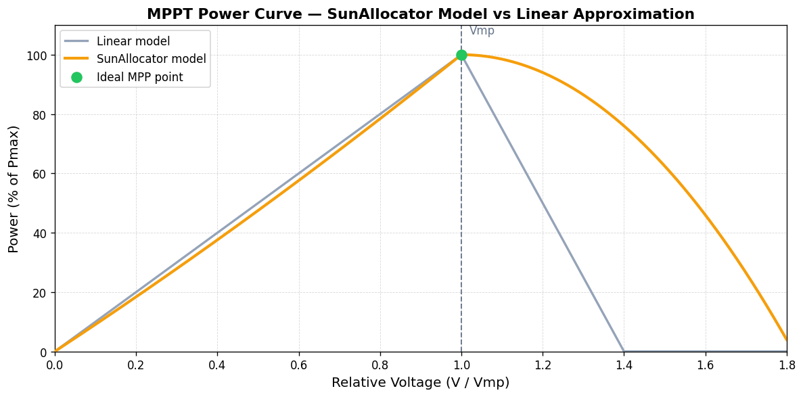

[🇬🇧 English](./concepts.md) | [🇺🇦 Українська](./concepts_uk.md)

# Technical Concepts

This document explains the core concepts and calculations used by the SunAllocator component.

## Excess Power Calculation

The `sun_allocator_excess_power` sensor calculates the untapped potential power that could be extracted from your solar panel. It is calculated as:

```
excess_power = estimated_max_power_at_current_voltage - current_pv_power_output
```

This value represents how many additional watts could be extracted from the panel at its current operating voltage. When this value is high, it indicates that your panel has significant untapped potential that could be utilized with additional loads.

## Understanding MPPT and Solar Panel Operation

Solar panels have a characteristic I-V (current-voltage) curve that determines their power output. The key points to understand:

1.  **Maximum Power Point (MPP)**: This is the optimal operating point where the product of voltage and current is maximized. It occurs at specific voltage (Vmp) and current (Imp) values.

2.  **Operating Regions**:
    *   **Below Vmp**: In this region, the panel operates with relatively constant current. As voltage increases, power increases approximately linearly.
    *   **At Vmp**: This is the optimal operating point where maximum power is produced.
    *   **Above Vmp**: In this region, current drops rapidly as voltage increases, causing power to decrease.

3.  **Excess Possible Indicator**: The `excess_possible` attribute is `true` when your panel's voltage exceeds Vmp. This indicates:
    *   The panel is operating in the constant-voltage region (above Vmp)
    *   Power output is likely less than optimal
    *   An MPPT controller could potentially increase power by reducing voltage to Vmp

4.  **Why it's usually "false"**: Most solar systems with MPPT controllers will operate at or below Vmp to maximize power, so `excess_possible` will typically be "false" during normal operation.

## MPPT-Based Maximum Power Calculation

The `current_max_power` value estimates the maximum power that could be extracted at the current voltage, based on Maximum Power Point Tracking (MPPT) principles. This helps you understand:

1.  How much power your panel could potentially produce at its current operating voltage
2.  Whether you're operating near the optimal voltage for maximum power
3.  How much additional power you could extract with optimal MPPT control

#### Technical Details of the MPPT Algorithm

SunAllocator uses an advanced model to estimate maximum possible power at any voltage:

1.  **Relative Voltage Calculation**:
    ```
    # Series wiring: each panel's voltage adds up
    relative_voltage = measured_pv_voltage_V / (panel_rated_vmp_V * number_of_panels_in_series)

    # Parallel wiring: voltage is the same as a single panel
    relative_voltage = measured_pv_voltage_V / panel_rated_vmp_V
    ```
    A value of `1.0` means the array is operating exactly at Vmp (maximum power point).

2.  **Power Estimation Model**:
    *   For voltage below or at Vmp (`relative_voltage ≤ 1.0`):
        ```
        # Polynomial approximation: slight upward curve toward Vmp,
        # matching the real constant-current region of the I-V curve.
        estimated_max_power_W = panel_rated_pmax_W * (
            relative_voltage * (1.0 - 0.1 * (1.0 - relative_voltage))
        )
        ```

    *   For voltage above Vmp (`relative_voltage > 1.0`):
        ```
        # Quadratic drop-off: power falls rapidly once voltage exceeds Vmp,
        # reflecting the steep decline in current in the constant-voltage region.
        estimated_max_power_W = panel_rated_pmax_W * max(
            0,
            1 - 1.5 * (relative_voltage - 1) ** 2
        )
        ```

3.  **Panel Configuration**:
    The algorithm accounts for different panel arrangements:
    *   **Series**: Voltage adds up, current remains the same
    *   **Parallel**: Current adds up, voltage remains the same


*Comparison of power curves showing how the improved algorithm better matches real-world panel behavior*

---

## Power Allocation Algorithm

This section describes how SunAllocator decides which devices to turn on and how much power to give each one.

### Step 1 — Calculate Excess Power

Each time the PV power sensor updates, SunAllocator calculates how much power is available for distribution:

```
# Default (no house consumption sensor):
# excess = the UNTAPPED headroom on the panel curve, minus reserves.
untapped_W     = estimated_max_power_at_current_voltage_W - current_panel_output_W
excess_power_W = untapped_W
              - inverter_self_consumption_W   # power the inverter itself uses (from settings)
              - reserved_battery_power_W      # power kept for battery charging (from settings)
```

`untapped_W` is positive **only when the array voltage sits above its maximum-power point
(Vmp)** — i.e. the inverter is throttling the panels because nothing is drawing the surplus.
SunAllocator offers devices only what the panels can actually deliver on top of the current
output. (Near the open-circuit voltage this estimate is approximate — irradiance is not
directly observable there — so the value is damped to avoid spikes.)

There is no separate "parallel" mode. Configuring a **house consumption sensor** simply
*refines* the same MPPT estimate by additionally bounding it with your real measured
consumption, which is more accurate:

```
# With a house consumption sensor (more accurate):
excess_power_W = min( untapped_W,
                      estimated_max_power_W - house_consumption_W - battery_charge_used_W )
              + battery_surplus_above_reserve_W
```

The battery reserve is split into a protected part (`min(charge, reserve)`) and any charge
above the reserve, which becomes available to devices. The reserve is modulated by the
**Share Surplus Above SOC** threshold (below it the battery keeps everything). A negative or
zero result means nothing is turned on.

### Calculation Method (mppt · mppt_probe · export)

The formula above is the **`mppt`** method (the default). A selectable **Calculation Method**
(Advanced Settings) lets you match the estimate to your inverter topology:

- **`mppt` (cautious, default)** — the untapped-headroom calculation described above. Safe, but
  it *underestimates* available solar on a load-following hybrid inverter when the battery is at
  its charge limit and the house load is low: the inverter then **curtails** the panels to match
  load, so `pv_power` tracks consumption and the model reads the curtailed output as "low
  irradiance". The `curtailment_detected` attribute flags when this is happening (meaningful
  headroom, battery not discharging, battery not accepting charge).

- **`mppt_probe` (MPPT + active probing)** — publishes the same cautious excess as `mppt`, plus a
  controller that recovers the curtailed energy the estimate cannot see. When curtailment is
  detected and a device is waiting only for more surplus, the probe grows a small *headroom*
  budget so the allocator turns the device on, then watches the battery: if the battery stays
  out of discharge the added load was free (covered by previously-curtailed PV) and the budget
  grows further; if the battery starts discharging the load was not free, so the budget backs off
  below that level and a cooldown prevents immediate retry (so an on/off load such as an AC
  compressor is not cycled). Device priority, partial fill and min-thresholds are all handled by
  the normal allocator consuming the inflated budget. "Battery at its charge limit" is detected
  from charge *power* near zero, **not** SOC — many inverters cap charging below 100 %.

- **`export` (energy balance)** — for **grid-export** inverters where `pv_power` reflects true
  generation rather than load-following output. Excess is a direct energy balance:
  ```
  excess_power_W = pv_power_W - house_consumption_W - inverter_self_consumption_W
                 - reserved_battery_charge_W
  ```
  Battery charge above the reserve falls through into the available surplus. This method does not
  use the MPPT I-V curve (the curve sensors remain only as diagnostics).

**Optional: forecast-guided probe.** If you set a **PV Forecast Sensor** (Settings — e.g.
Forecast.Solar or Open-Meteo, combined into one entity for multi-slope arrays), the probe uses the
forecast as its growth **target** instead of probing blind: it grows the headroom toward
`forecast − pv_power`, closing about 25 % of the remaining gap each tick, and the battery validates
every step exactly as above — a discharge *before* the target is reached means the forecast was
optimistic, so the budget backs off below that level and a cooldown follows (effectively distrusting
the forecast until it recovers). A forecast also enables this probe-style growth in the cautious
`mppt` method; there the recovered headroom feeds only the **speculative** budget that devices with
*Allow Speculative Surplus* may consume, so opt-out loads (e.g. an AC you don't want cycled) always stay
on the plain cautious excess. The published `excess_power` value is **never** lifted by the forecast
— it surfaces only through the `forecast_potential_w`, `forecast_untapped_w` and `probe_headroom_w`
diagnostic attributes.

**Per-device opt-in.** Whether a device may consume this speculative headroom is a per-device
setting, *Allow Speculative Surplus* (`allow_probe`, Advanced Settings). The available surplus is
split into two pools: a **real** pool (the cautious excess — genuinely available, usable by every
device) and an **extra** pool (the probe/forecast-discovered headroom on top). Devices with
*Allow Speculative Surplus* off draw only from the real pool, so a load you never want speculatively
driven (e.g. an AC compressor) always runs on the cautious excess alone.

### Battery-SOC Protection

Battery protection has **two independent axes** that act on different battery phases, plus a global
floor. All thresholds are optional (0 disables the per-device axes; the global floor and sharing
threshold are also 0 = disabled).

- **START (charge side)** — per-device `start_battery_soc`. A device may **start** only when SOC ≥
  this. This gates new starts only; a device already running is never turned off by the start gate.

- **STOP (discharge side)** — per-device `stop_battery_soc`. While the battery is **discharging**, a
  running device is forced **off** when SOC < this. It never fires while the battery is charging or
  neutral, so a load stays on as long as solar still covers it. Two special values:
  - **0** — inherit the global `battery_protection_soc` floor. No extra per-device stop rule applies;
    the device may discharge the battery all the way down to the global floor.
  - **100** (default) — never discharge the battery for that device.
  - Any other value must be **≥** the global protection floor and is **enforced on save** (a non-zero
    value below the floor is rejected, not silently accepted; `0` is exempt from this check).

- **Absolute floor** — global `battery_protection_soc`. Below it **every** controlled device is
  forced off regardless of charge direction. A non-zero per-device `stop_battery_soc` must be at or
  above this floor (validated on save); `0` is exempt and simply inherits it.

- **Battery sharing** — global `battery_sharing_soc` ("Share Surplus Above SOC"). Below it the
  battery keeps absolute charge priority (excess is held at 0); at or above it the surplus is shared
  with devices.

A **hysteresis** band of 2 % around each threshold prevents flapping at the boundary. A "discharge"
is only counted when the battery net draw exceeds `battery_discharge_tolerance_w` (default **20 W**),
so minor jitter — while solar still covers the load and the battery is roughly neutral — does not shed
a running load.

### Step 2 — Filter Devices

Before any device is considered for allocation, it must pass several checks:

- **Auto-control enabled**: Only devices with auto-control turned on are processed.
- **Entity exists**: The controlled HA entity must be available in Home Assistant.
- **Schedule check**: If the device has a schedule, the current time must be within the allowed window. If the device is currently on but outside its schedule, it is turned off immediately.
- **Check-usable template**: If the device has a `check_usable` template, it must render truthy; otherwise the device is treated as not usable and turned off. (A broken template fails open — the device is treated as usable and a warning is logged.)
- **Manual control**: A manual toggle (see below) is evaluated *before* the schedule and check-usable filters and **overrides both** — only battery-SOC protection can force a manually-ON device off.

Devices that fail any check are skipped and their filter reason is stored for diagnostics.

### Step 3 — Determine Device State (On/Off Decision)

For each eligible device, the allocator decides whether it should be active using hysteresis thresholds:

```
# Turn-on threshold: device activates when excess covers its rated minimum draw
on_threshold_W  = device_min_expected_W            # e.g. 500 W for a floor heater

# Turn-off threshold: device stays on until power drops well below the turn-on level
# (hysteresis gap prevents flicker when solar output fluctuates around the threshold)
off_threshold_W = device_min_expected_W - global_hysteresis_W   # e.g. 500 - 40 = 460 W
```

- **Turn ON**: if `excess_power_W >= on_threshold_W` AND the device was previously off.
- **Stay ON**: if `excess_power_W >= off_threshold_W` AND the device was previously on.
- **Turn OFF**: if `excess_power_W < off_threshold_W`.

This prevents rapid on/off cycling when solar power fluctuates around the threshold.

**Debounce**: A state change is not applied immediately. The device enters a candidate state and only transitions after the configured debounce time has elapsed without the candidate state changing.

### Step 4 — Minimum On-Time and Startup Grace Period

To protect appliances (compressors, heat pumps, pumps) from rapid cycling:

- **Minimum on-time**: Once a device turns on, it stays on for at least `min_on_time` seconds, even if power drops below the off-threshold.
- **Startup grace period**: When a device first turns on, it gets an additional protective time interval of 90 seconds so that the MPPT has time to reach the highest voltage point (during this time, partial consumption from the battery and/or network is possible).

### Step 5 — Power Allocation

Each device is controlled in one of two **control modes**, chosen per device when you pick its
entity (the entity picker offers a `(Switch)` row for on/off and a `(Dimmer)` row for proportional):

- **On/off** — the device is either fully on or fully off. This covers a plain HA switch, a climate
  entity, or an ESPHome relay driven on/off via its mode select (`On` / `Off`).
- **Proportional** — the device is modulated between a floor and a cap. This is either a dimmable HA
  light driven via its brightness (`light.turn_on` with `brightness`), or an ESPHome relay driven via
  its mode select set to `Proportional` plus brightness. (This replaces the older "standard vs custom
  ESPHome" device-type distinction — the capability is now chosen by control mode, not device type.)

Devices are sorted by **priority** (highest first). The allocator iterates over them and assigns power from the remaining budget:

#### On/off devices

Each active on/off device is allocated exactly `min_expected_w` from the budget:

```
# Device gets exactly its configured minimum rated draw
power_allocated_to_device_W  = device_min_expected_W    # e.g. 500 W
remaining_solar_budget_W    -= power_allocated_to_device_W
```

If there is not enough remaining power for a device, it is turned off.

#### Proportional devices

The proportional target is calculated based on available power and the device's max capacity:

```
# What fraction of the device's capacity can the current solar output support?
target_percent = clamp(
    5%,    # never go below 5% (avoids flicker at near-zero levels)
    90%,   # cap at 90% (safety headroom)
    (remaining_solar_budget_W / device_max_expected_W) * 100%
)

# Power actually consumed at this target level
power_used_W = min(remaining_solar_budget_W, device_max_expected_W * target_percent / 100%)
```

**Allocation strategies** (configurable in Advanced Settings):
- **Fill one by one**: Each device (highest priority first) gets as much as it needs. Remaining power goes to the next device.
- **Distribute evenly**: Available power is split proportionally among all active proportional devices based on their `max_expected_w`.

### Step 6 — Apply State to Entities

After all decisions are made, the allocator calls HA services:

| Device / Condition | HA Service called |
|-|-|
| On/off switch / light → turn on | `switch.turn_on` / `light.turn_on` |
| Climate entity → turn on | `climate.set_hvac_mode` with the configured HVAC mode |
| On/off ESPHome relay → turn on | mode select → `On` |
| Any device → turn off | corresponding `turn_off` / `set_hvac_mode: off` / mode select → `Off` |
| Proportional (dimmable light) → set level | `light.turn_on` with `brightness` |
| Proportional (ESPHome relay) → set level | mode select → `Proportional`, then brightness |

The allocator checks the **actual HA entity state** before sending a command. If the entity is already in the desired state, the call is skipped to avoid redundant traffic.

### Step 7 — Update Sensors

After processing, the allocator stores the results in shared memory and fires a dispatcher signal. The `sun_allocator_power_distribution` sensor receives this signal and updates its state and attributes with the current allocation data for all devices.

---

## Watchdog

A watchdog timer monitors whether the PV power sensor is still sending updates. If no update is received within the configured timeout:

1. All controlled devices are turned off (fail-safe).
2. An alert is logged.
3. Auto-control resumes automatically once the sensor starts reporting again.

The default timeout is **3 minutes** (configured via `WATCHDOG_STALE_AFTER_MINUTES` in `core/settings.py`).

---

## Device Status States

The per-device `device_status` ENUM sensor exposes the current control state. Possible values:

| State | Meaning |
|---|---|
| `active` | Device is currently allocated power (>0 W) and considered ON. |
| `idle` | Relay is commanded ON but the actual-power sensor confirms draw below its threshold (e.g. a boiler reached target temperature and the element cycled off). |
| `insufficient_power` | Excess power is below the device's `min_expected_w`. |
| `debouncing_on` | Device is candidate ON but still inside its debounce window. |
| `debouncing_off` | Device is currently ON but candidate has dropped — turn-off pending. |
| `auto_control_off` | The device's auto-control switch (or config flag) is OFF. |
| `manual_active` | User manually turned the device **on** while auto-control is enabled; the allocator keeps it on and accounts its draw against the budget ("Manual (on)"). |
| `manual_override` | User manually changed the entity state (a manual **off**, or an on kept pending during reconciliation); auto-control is suppressed for that device. The choice is sticky — see below. |
| `filtered` | The device was excluded this cycle: outside schedule, not usable (template), entity unavailable, or unsupported domain. The `refusal_reasons` attribute carries the human-readable reason. |
| `trying_on` / `trying_off` | The desired command was sent but the entity has not yet reflected it; retried every 30 s up to `RETRY_MAX_ATTEMPTS` (default 3). |
| `failed_on` | After `RETRY_MAX_ATTEMPTS` the ON command was abandoned; the user is notified once via persistent_notification. |

## Manual Control

If the entity changes state outside of an allocator-issued command (e.g. you flip the switch in the Lovelace UI) while auto-control is enabled, the allocator records that choice and makes it **sticky** — there is **no timeout**:

- A manual **ON** is kept on and its draw is accounted against the budget (so other auto devices see the real remaining surplus); the `device_status` sensor reports `manual_active`.
- A manual **OFF** stays off — auto-control will not re-enable it; the `device_status` sensor reports `manual_override`.

A manual choice **overrides** the schedule window **and** the `check_usable` template: while it is in effect the device ignores both. The only thing that can force a manually-**ON** device off is **battery-SOC protection** (the discharge-side stop floor or the absolute protection floor).

Besides the per-device **"Auto Control"** switch, each controlling device exposes a per-device
**"Switch"** entity on the SunAllocator device card. This is a proxy that toggles the controlled
entity directly and mirrors its live state, so you can command the load without leaving the
SunAllocator card. Toggling this **"Switch"** while auto-control is on behaves exactly like flipping
the underlying entity by hand: it is registered as a sticky manual override (`manual_active` for a
manual on), subject to all the rules above.

The sticky manual state persists until one of:

1. the auto-control switch is toggled **off → on** (this resumes normal automatic control), or
2. the local **calendar day rolls over** (the choice is cleared at midnight), or
3. **battery-SOC protection** trips (only for a manual ON).
